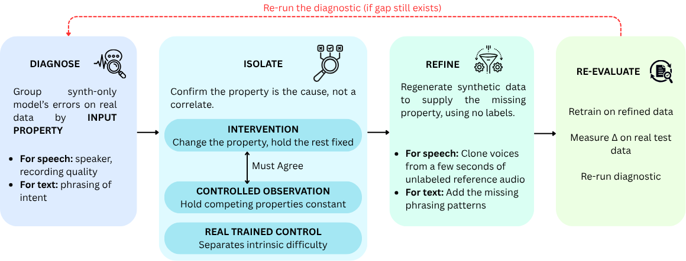

# Beyond Naturalness: Diagnosing the Synthetic-to-Real Gap in Spoken Language Understanding

[](https://www.python.org/downloads/)

Code and results for our work on where synthetic training data for spoken
language understanding actually falls short and how to fix it without
annotating anything new.

Synthetic data is usually treated as uniformly "lower quality" than real data.
We find the deficit is not diffuse at all. It concentrates in **one nameable
dimension per modality**, and in both cases it is not the dimension practitioners
normally attack:

- **Speech: speaker identity, not channel noise.** Matching the telephony
  channel to within ~7% on every acoustic metric we measured moved
  synthetic-to-real transfer by **+0.93pp**. Cloning the speakers' voices moved
  it by **+22.29pp**.
- **Text: pragmatic indirection, not vocabulary.** Cleaning up slot values and
  vocabulary gained **+0.57pp**. Adding first-person and explanatory phrasings
  gained **+4.59pp**.

Both are closed using only resources that need no annotation, cutting the real
data required to approach ceiling performance by roughly **10x**.

## Contents

|                                        |                                                          |
| -------------------------------------- | -------------------------------------------------------- |
| [docs/RESULTS.md](docs/RESULTS.md)     | every number, with pointers to the JSON that produced it |
| [docs/REPRODUCE.md](docs/REPRODUCE.md) | table → command → expected value                         |
| [docs/DATA.md](docs/DATA.md)           | obtaining the corpora, and their licences                |
| `results/`                             | committed result JSONs for all 12 tables                 |

## The method

A four-step loop, applied independently to speech and to text:

1. **Diagnose**: run the synthetic-only model on the real test set and group
   errors by _input property_, not by label.
2. **Isolate**: change one property in the synthetic data with everything else
   fixed, and separately measure that property's effect with competing factors
   held constant. Both must agree. A real-trained control subtracts difficulty
   intrinsic to the input.
3. **Refine**: regenerate the data supplying the missing property, using only
   resources that require no annotation.
4. **Re-evaluate**: retrain, and confirm the _targeted_ property is what moved.

The isolation step is what makes this more than error analysis. On the speech
side, the intervention (voice +22pp vs channel +0.9pp) and the confound-controlled
observation (synth-specific penalty 24.7pp vs 1.3pp) are independent measurements
that agree at roughly 20x.



## Architecture Diagram


## Benchmarks

| Dataset            | Domain     | Languages   | Modality      | Task           |
| ------------------ | ---------- | ----------- | ------------- | -------------- |
| SNIPS Smart Lights | smart home | en, fr      | text + speech | intent + slots |
| Skit-S2I           | banking    | en (IN)     | speech        | intent         |
| MultiATIS++        | air travel | 9 languages | text          | intent + slots |

None are redistributed here. See [docs/DATA.md](docs/DATA.md) — **MultiATIS++
requires an LDC licence and cannot be redistributed at all**, and Skit-S2I is
CC BY-NC 4.0.

## Layout

```
src/slu_gap/          importable library
  models/             JointBERT + Bi-LSTM (intent + slot)
  speech.py           Whisper intent classifier, shared by all speech runs
  telephony.py        the 9-stage telephony channel simulation
  datasets.py         corpus loaders
  paths.py            all filesystem locations, environment-overridable

pipelines/            synthetic data generation
  snips/  skit_s2i/  multiatis/
  voice_cloning/      F5-TTS speaker cloning

experiments/          one directory per class of experiment
  contamination/  zero_shot_llm/  cross_validation/
  domain_tuning/  diagnostics/    ablations/  multiatis/  data_prep/

results/              committed result JSONs
paper/                LaTeX table, appendix, and figure fragments
docs/                 reproduction, data, and results documentation
```

## Installation

Three environments are required, and they genuinely cannot be merged.

**Main**: text pipelines, NLU baselines, all Whisper experiments:

```bash
python -m venv .venv
source .venv/bin/activate          # Windows: .venv\Scripts\activate

# Install CUDA torch FIRST, or pip resolves the CPU wheel and speech
# experiments run roughly 50x slower.
pip install torch==2.9.1 torchaudio==2.9.1 --index-url https://download.pytorch.org/whl/cu126
pip install -r requirements/base.txt
pip install -e .
```

**Voice cloning**: F5-TTS pins versions that conflict with the above:

```bash
python -m venv .venv_f5tts
source .venv_f5tts/bin/activate
pip install torch==2.9.1 torchaudio==2.9.1 --index-url https://download.pytorch.org/whl/cu126
pip install -r requirements/f5tts.txt
```

**Snips NLU**, the original SNIPS benchmark's own library, used so our numbers
are comparable to the published baseline rather than to a reimplementation.
`snips-nlu` 0.20.2 is the final release and requires Python 3.8 with numpy<1.20.
On Windows, run it under WSL:

```bash
python3.8 -m venv .venv_wsl
source .venv_wsl/bin/activate
pip install -r requirements/snipsnlu.txt
python -m snips_nlu download en
```

Scripts state which environment they need in their module docstring.

Text generation and translation use a local [Ollama](https://ollama.com) server
(`ollama pull llama3.2 llama3.3`).

## Quick start

The cheapest command that reproduces a published table exactly (CPU, minutes):

```bash
python experiments/contamination/contamination_check.py
```

Expected: SNIPS 3.80%, Skit-S2I 1.20%, MultiATIS++ 0.40% exact-match rate.
